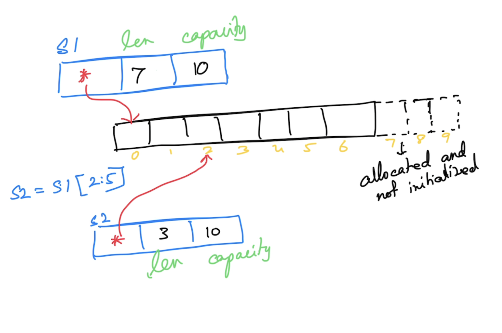

# Go Foundation

## Magesh Kuppan
- tkmagesh77@gmail.com
- 99019-11221

## What & When
- Commence      : 9:00 AM
- Tea Break     : 10:30 AM (20 mins)
- Lunch Break   : 12:30 PM (1 hr)
- Tea Break     : 3:00 PM (20 mins)
- Wind up       : 4:30 PM 

## Methodology
- No powerpoint
- Discussion & Code

## Repository
- https://github.com/tkmagesh/cisco-gofoundation-feb-2025

## Prerequisites
- Go Tools (https://go.dev/dl)
    - verification
    ```shell
        go version
    ```
- Visual Studio Code (https://code.visualstudio.com)
    - Go extension (https://marketplace.visualstudio.com/items?itemName=golang.Go)

## Why Go?
- Simplicity
    - ONLY 25 keywords
    - No access modifiers
    - No reference types (everything is a value)
    - No pointer arithmatic
    - No classes (Only structs)
    - No inheritance (Only composition)
    - No exceptions (Only errors & errors are just values)
    - No try..catch..finally
    - No implicit type conversion
- Performance
    - Equivalent to C++
    - Compiled to machine code
    - Tooling system supports cross-compilation
- Concurrrency
    - Managed concurrency model (built in scheduler)
    - Concurrent operations are represented as "goroutines"
    - Goroutines are cheap (4KB)
    - Support for concurrency is offered in the "language"
        - "go" keyword
        - "chan" data type
        - "<-" operator (channel)
        - "range" construct
        - "select-case" construct
    - Standard Library Support
        - "sync" package
        - "sync/atomic" package

## Compile 
```shell
go build [filename.go]

# OR

go build -o [binary_name] [filename.go]
```

## Compile & Execute
```shell
go run [filename.go]
```

## Cross Compilation
### To list all environment variables
```shell
go env
```
### To list given environment variables
```shell
go env [var_1] [var_2] ...
```

### To change the env variables
```shell
go env -w [var_1]=[value_1] [var_2]=[value_2] ...
```

### To list the supported platforms
```shell
go tool dist list
```

### To cross compile
```shell
GOOS=[target_os] GOARCH=[target_arch] go build [filename.gio]
# ex:
GOOS=windows GOARCH=amd64 go build 01-hello-world.go
```

## Data Types
- string
- bool
- integers
    - int8
    - int16
    - int32
    - int64
    - int
- unsigned integers
    - uint8
    - uint16
    - uint32
    - uint64
    - uint
- floating points
    - float32
    - float64
- complex
    - complex64 ( real[float32] + imaginary[float32] )
    - complex128 ( real[float64] + imaginary[float64] )
- alias
    - byte (alias for unsigned int)
    - rune (alias for unicode code point)

### Zero values
| Data Type | Zero value |
------------ | ------------- |
|int family     | 0 |
|uint family    | 0 |
|complex family | (0+0i) |
|string         | "" (empty string) |
|bool           | false |
|byte           | 0 |
|interface      | nil |
|pointer        | nil |
|function       | nil |
|struct         | struct instance |

## Variable Declarations
- Using "var" keyword
    - Can be used in both function & package scope
- Using ":="
    - Can be used ONLY in function scope

## Scope
- Package scope
    - Can have "unused" variables
- Function scope
    - Cannot have "unused" variables

## Constant
- Can have unused constants even in "function" scope

## IOTA
- auto-generated constant values for a group of constants

## Constructs
- if else
- switch case
- for

## Functions
- Can have more than one return result
- Variadic functions
- Anonymous functions
- Higher Order functions
    - Assign a function as a value to a variable
    - Pass a function as an argument
    - Return a function as a return value
- Deferred functions
    - postpone the execution of a function until the current function execution is completed

## Collections
### Array
- Fixed sized typed collection
### Slice
- Varying sized typed collection
- Functions
    - len
    - cap
    - append

### Map
- Typed collection of key/value pairs

## Error handling
- errors are values "returned" from a function
- Even though any value (int, string etc) can be used to represent errors, by convention, error values in Go should implement "error" interface
- Creating an error
    - Factory functions
        - errors.New()
        - fmt.Errorf()
    - Custom types that implement "error" interface

## Panic & Recovery
### Panic
- represents the state of the application where the application execution is unable to proceed further
- when a panic occurs, the runtime will attempt to shutdown the application after all the already deferred functions are executed
- Creating a panic
    - Use panic()
    - typically pass and error (that led to the panic) as an argument to panic()

## Modules & Packages
### Module
- Code that need to be versioned and deployed together
- Typically, a module is a folder with "go.mod" file
- go.mod file is the manifest file of the module
    - name
        - should include the complete repo path
    - go version
    - dependencies
#### Create a module
```shell
go mod init [module_name]
```
#### To run a module
```shell
go run .
```

#### To create a build
```shell
go build .
```

#### To import 3rd party modules
[Code downloaded to $GOPATH/pkg folder]
```shell
go get [module-name]
```

#### To updated the references in the go.mod file
```shell
go mod tidy
```

#### To explicitly download the dependencies
```shell
go mod download
```

#### To localize the dependencies (in a "vendor" folder)
```shell
go mod vendor
```
#### Other useful mod commands
```shell
go mod graph
go mod why [package-name]
```

### Reference
- https://go.dev/ref/mod

### Package
- Internal organization of a module
- Typically folders
- Can be nested
- All the files in a package are considered to be one single entity
- Public entities should have their names starting in uppercase

## Concurrency
### Thread Based Concurrency Model


### GoConcurrency Model


### WaitGroup
- Semaphore based counter
- Has the ability to block the execution of a function until the counter becomes 0

### Data Race
#### Detecting data races
```shell
go run -race [filename.go]
```
```shell
go build -race [filename.go]
```